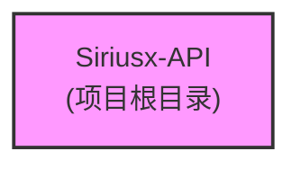

# Siriusx-API 项目文档

> 最后更新：2025-09-30 14:03:38 CST

## 变更记录 (Changelog)

### 2025-09-30 14:03:38
- 初始化项目 AI 上下文文档
- 项目当前处于初始化阶段，暂无代码模块

---

## 项目愿景

Siriusx-API - 待定义项目愿景和目标。

## 架构总览

项目当前处于初始化阶段，架构设计待完善。

## 模块结构图



> 注：项目当前无模块，等待后续开发填充。

## 模块索引

| 模块路径 | 语言/技术栈 | 职责描述 | 状态 | 文档链接 |
|---------|------------|---------|------|---------|
| - | - | 暂无模块 | 待开发 | - |

## 技术栈

待确定。建议在项目开发时更新此部分，包括：
- 主要编程语言
- 框架与库
- 数据库
- 部署方式

## 运行与开发

### 环境要求

待定义。

### 安装依赖

```bash
# 待添加依赖安装命令
```

### 启动开发环境

```bash
# 待添加启动命令
```

### 构建与部署

```bash
# 待添加构建命令
```

## 测试策略

待定义测试策略，建议包括：
- 单元测试
- 集成测试
- E2E 测试
- 测试覆盖率目标

## 编码规范

待定义编码规范，建议包括：
- 代码风格指南
- 命名约定
- 注释规范
- Git 提交规范

## AI 使用指引

### 项目特点

- 项目当前处于初始化阶段
- 暂无代码模块和依赖
- 适合从零开始构建

### 推荐 AI 工作流

1. **需求分析**：明确项目目标和功能范围
2. **技术选型**：确定语言、框架、数据库等
3. **架构设计**：设计模块划分和接口规范
4. **迭代开发**：逐步实现各个模块
5. **文档更新**：随开发进度更新本文档

### AI 协作建议

- 每次添加新模块时，在 `.claude/` 目录中运行初始化更新
- 保持本文档与代码同步
- 使用模块级 CLAUDE.md 记录详细设计

## 目录结构建议

```
Siriusx-API/
├── CLAUDE.md              # 本文档
├── README.md              # 项目说明
├── .claude/
│   └── index.json        # AI 索引文件
├── src/                   # 源代码目录（建议）
├── tests/                 # 测试目录（建议）
├── docs/                  # 额外文档（可选）
└── scripts/               # 构建脚本（可选）
```

## 相关资源

- 项目仓库：待添加
- 文档站点：待添加
- 问题追踪：待添加

---

**下一步行动建议：**

1. 确定项目的技术栈和架构方向
2. 创建基础项目结构（src、tests 等）
3. 添加依赖管理文件（package.json、go.mod、requirements.txt 等）
4. 实现第一个核心模块
5. 重新运行初始化以更新文档
