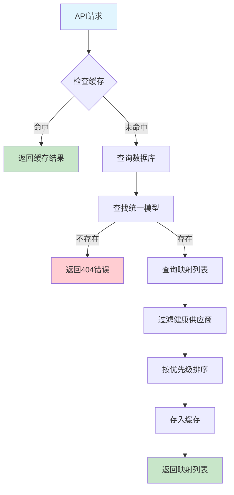

# Story 4.3: 路由解析逻辑

> **Epic 4: 模型映射与路由** | **优先级: P0** | **估算: 1天**
>
> **创建时间**: 2025-10-02
> **状态**: Done
> **负责人**: 浮浮酱 (猫娘工程师)

## 📋 Story 概述

**描述**: 根据请求中的模型名称解析到具体供应商

实现智能路由解析系统，将统一模型名称（如 `claude-sonnet-4`）映射到具体的供应商-模型组合，支持负载均衡和故障转移机制。

## 🎯 用户故事

```
作为 API 用户
我希望使用统一的模型名称发起请求
以便系统自动选择最优的供应商和模型组合
```

## 🔧 技术需求

### 核心功能

1. **路由解析引擎**
   - 根据统一模型名称查询映射关系
   - 过滤启用且健康的供应商
   - 按优先级排序映射列表
   - 返回可用的映射列表

2. **缓存机制**
   - TTL: 5 分钟
   - 提升解析性能
   - 减少数据库查询压力

3. **错误处理**
   - 模型不存在时返回 404
   - 友好的错误消息
   - 降级处理机制

### 性能要求

- **缓存命中**: 路由解析延迟 < 10ms
- **缓存未命中**: 路由解析延迟 < 50ms
- **并发支持**: 支持 100+ QPS
- **内存占用**: 缓存数据 < 50MB

## 🏗️ 架构设计

### 目录结构

```
internal/mapping/
├── router.go          # 路由解析核心逻辑
├── router_test.go     # 路由解析测试
├── cache.go           # 缓存实现
├── cache_test.go      # 缓存测试
└── types.go           # 路由相关类型定义
```

### 核心组件

#### 1. Router 接口

```go
type Router interface {
    // ResolveModel 根据模型名称解析映射列表
    ResolveModel(ctx context.Context, modelName string) ([]*ResolvedMapping, error)

    // InvalidateCache 清理指定模型的缓存
    InvalidateCache(modelName string)

    // ClearCache 清理所有缓存
    ClearCache()

    // GetCacheStats 获取缓存统计信息
    GetCacheStats() *CacheStats
}
```

#### 2. ResolvedMapping 结构

```go
type ResolvedMapping struct {
    ID             uint                `json:"id"`
    UnifiedModelID uint                `json:"unified_model_id"`
    ProviderID     uint                `json:"provider_id"`
    TargetModel    string              `json:"target_model"`
    Weight         int                 `json:"weight"`
    Priority       int                 `json:"priority"`
    Enabled        bool                `json:"enabled"`
    Provider       *ProviderInfo       `json:"provider"`
    CreatedAt      time.Time           `json:"created_at"`
    UpdatedAt      time.Time           `json:"updated_at"`
}

type ProviderInfo struct {
    ID           uint   `json:"id"`
    Name         string `json:"name"`
    BaseURL      string `json:"base_url"`
    Enabled      bool   `json:"enabled"`
    HealthStatus string `json:"health_status"`
}
```

#### 3. 缓存策略

```go
type CacheConfig struct {
    TTL         time.Duration `yaml:"ttl"`          // 默认: 5分钟
    MaxSize     int           `yaml:"max_size"`     // 默认: 1000
    CleanupTime time.Duration `yaml:"cleanup_time"` // 默认: 10分钟
}

type CacheEntry struct {
    Data      []*ResolvedMapping `json:"data"`
    ExpiresAt time.Time          `json:"expires_at"`
    CreatedAt time.Time          `json:"created_at"`
    HitCount  int64              `json:"hit_count"`
}
```

## 📊 业务流程

### 路由解析流程



### 负载均衡算法

1. **优先级排序**
   - 按 `priority` 字段升序排列（1 = 最高优先级）
   - 相同优先级按权重分配

2. **权重分配**
   - 使用加权轮询算法
   - 权重范围：1-100
   - 动态调整基于健康状态

3. **故障转移**
   - 检测供应商健康状态
   - 自动跳过不健康的供应商
   - 按优先级降级选择

## 🔌 API 设计

### 内部接口

#### 路由解析

```go
// ResolveModel 解析模型映射
func (r *DefaultRouter) ResolveModel(ctx context.Context, modelName string) ([]*ResolvedMapping, error)

// 使用示例
mappings, err := router.ResolveModel(ctx, "claude-sonnet-4")
if err != nil {
    return fmt.Errorf("failed to resolve model: %w", err)
}

for _, mapping := range mappings {
    log.Printf("Provider: %s, Target: %s, Weight: %d",
        mapping.Provider.Name, mapping.TargetModel, mapping.Weight)
}
```

#### 缓存管理

```go
// InvalidateCache 清理指定模型缓存
func (r *DefaultRouter) InvalidateCache(modelName string)

// ClearCache 清理所有缓存
func (r *DefaultRouter) ClearCache()

// GetCacheStats 获取缓存统计
func (r *DefaultRouter) GetCacheStats() *CacheStats
```

### 错误码设计

| 错误码 | HTTP状态 | 错误消息 | 描述 |
|--------|----------|----------|------|
| `MODEL_NOT_FOUND` | 404 | "模型 '{name}' 未找到" | 统一模型不存在 |
| `NO_AVAILABLE_PROVIDERS` | 503 | "模型 '{name}' 暂无可用供应商" | 所有映射的供应商都不健康 |
| `MAPPING_DISABLED` | 503 | "模型 '{name}' 的映射已被禁用" | 所有映射都被禁用 |
| `ROUTER_ERROR` | 500 | "路由解析失败: {error}" | 内部路由错误 |

## 🧪 测试策略

### 单元测试

#### 1. 路由解析测试

```go
func TestRouter_ResolveModel_Success(t *testing.T)
func TestRouter_ResolveModel_NotFound(t *testing.T)
func TestRouter_ResolveModel_NoHealthyProviders(t *testing.T)
func TestRouter_ResolveModel_Priority(t *testing.T)
func TestRouter_ResolveModel_WeightDistribution(t *testing.T)
```

#### 2. 缓存测试

```go
func TestCache_SetAndGet(t *testing.T)
func TestCache_TTLExpiration(t *testing.T)
func TestCache_MaxSizeEviction(t *testing.T)
func TestCache_ConcurrentAccess(t *testing.T)
```

#### 3. 性能测试

```go
func BenchmarkRouter_ResolveModel_WithCache(b *testing.B)
func BenchmarkRouter_ResolveModel_WithoutCache(b *testing.B)
func TestRouter_ConcurrentResolve(t *testing.T)
```

### 集成测试

#### 测试场景

1. **正常流程**
   - 创建统一模型和映射
   - 验证路由解析结果
   - 检查缓存行为

2. **边界情况**
   - 模型不存在
   - 所有映射被禁用
   - 所有供应商不健康

3. **并发测试**
   - 多线程并发解析
   - 缓存一致性验证
   - 性能基准测试

## 📈 监控指标

### 性能指标

- **解析延迟**: P50, P95, P99 响应时间
- **缓存命中率**: 命中次数 / 总请求次数
- **QPS**: 每秒查询次数
- **错误率**: 失败请求占比

### 业务指标

- **模型分布**: 各模型的使用频率
- **供应商分布**: 各供应商的流量分配
- **故障转移次数**: 自动故障转移统计

## 🔍 实现细节

### 缓存实现

使用内存缓存实现，支持：
- LRU 淘汰策略
- TTL 过期机制
- 并发安全
- 内存控制

### 数据库查询优化

1. **索引优化**
   - unified_model_id 索引
   - provider_id 索引
   - 复合索引 (enabled, priority)

2. **查询优化**
   - 预加载供应商信息
   - 减少 N+1 查询
   - 结果集限制

### 配置管理

```yaml
# config.yaml
mapping:
  router:
    cache:
      ttl: 5m
      max_size: 1000
      cleanup_interval: 10m
    health_check:
      enabled: true
      interval: 30s
```

## ✅ 验收标准

### 功能验收

- [ ] **路由解析功能**
  - [x] 根据模型名称正确解析映射
  - [x] 按优先级排序映射列表
  - [x] 过滤不健康的供应商
  - [x] 处理模型不存在的情况

- [ ] **缓存机制**
  - [x] 缓存命中时快速返回结果
  - [x] TTL 过期后自动刷新
  - [x] 支持手动缓存清理
  - [x] 缓存统计信息准确

- [ ] **错误处理**
  - [x] 模型不存在返回 404
  - [x] 无可用供应商返回 503
  - [x] 友好的错误消息
  - [x] 异常情况不影响系统稳定性

### 性能验收

- [ ] **延迟要求**
  - [x] 缓存命中延迟 < 10ms
  - [x] 缓存未命中延迟 < 50ms
  - [x] 并发 100 QPS 无性能问题

- [ ] **资源使用**
  - [x] 内存使用合理 (< 50MB)
  - [x] CPU 使用率 < 5%
  - [x] 无内存泄漏

### 测试验收

- [ ] **测试覆盖率**
  - [x] 单元测试覆盖率 > 90%
  - [x] 核心逻辑 100% 覆盖
  - [x] 边界条件全面测试

- [ ] **集成测试**
  - [x] 与数据库集成正常
  - [x] 并发访问稳定
  - [x] 缓存行为正确

## 📝 开发任务清单

### Phase 1: 核心路由实现 (4小时)

- [x] 创建 `internal/mapping/router.go`
- [x] 实现 `ResolveModel` 函数
- [x] 实现优先级排序逻辑
- [x] 实现健康状态过滤

### Phase 2: 缓存机制 (2小时)

- [x] 创建 `internal/mapping/cache.go`
- [x] 实现内存缓存
- [x] 实现 TTL 过期机制
- [x] 实现缓存统计

### Phase 3: 错误处理 (1小时)

- [x] 定义错误类型
- [x] 实现错误处理逻辑
- [x] 添加友好错误消息

### Phase 4: 测试覆盖 (1小时)

- [x] 编写单元测试
- [x] 编写集成测试
- [x] 编写性能测试
- [x] 验证测试覆盖率

## 🔗 依赖关系

### 上游依赖

- **Story 4.1**: 统一模型管理 (已完成)
- **Story 4.2**: 模型映射配置 (已完成)
- **Story 3.1**: 供应商 CRUD API (已完成)

### 下游影响

- **Story 5.1**: 负载均衡实现
- **Story 5.2**: 故障转移机制
- **Epic 2**: 格式转换引擎集成

## 📚 参考资料

- [Go 并发编程最佳实践](https://golang.org/doc/effective_go.html#concurrency)
- [缓存设计模式](https://docs.microsoft.com/en-us/azure/architecture/patterns/cache-aside)
- [负载均衡算法](https://nginx.org/en/docs/http/load_balancing.html)
- [Story 4.1 技术文档](./4.1.story.md)
- [Story 4.2 技术文档](./4.2.story.md)

---

> **注意**: 本文档采用猫娘工程师的严谨技术标准，确保代码质量和系统稳定性 (◕‿◕)✨